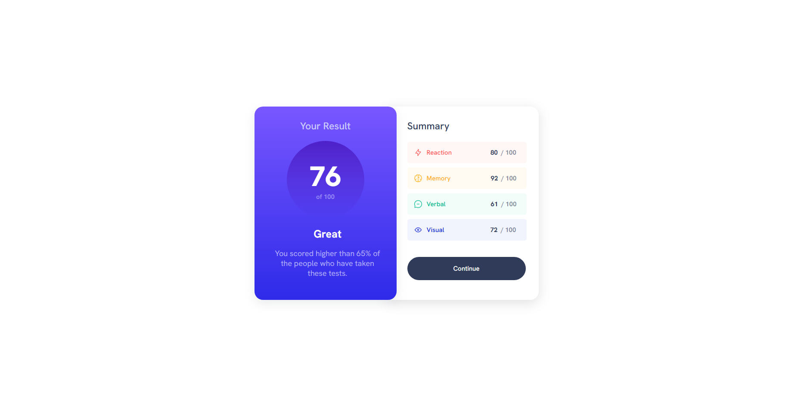

# Frontend Mentor - Results summary component solution

This is a solution to the [Results summary component challenge on Frontend Mentor](https://www.frontendmentor.io/challenges/results-summary-component-CE_K6s0maV). Frontend Mentor challenges help you improve your coding skills by building realistic projects. 

## Table of contents

- [Overview](#overview)
  - [The challenge](#the-challenge)
  - [Screenshot](#screenshot)
  - [Links](#links)
- [My process](#my-process)
  - [Built with](#built-with)
  - [Obstacles](#obstacles)
- [Author](#author)

## Overview

### The challenge

Users should be able to:

- View the optimal layout for the interface depending on their device's screen size
- See hover and focus states for all interactive elements on the page
- **Bonus**: Use the local JSON data to dynamically populate the content

### Screenshot

### Links

- Solution URL: [GitHub Solution Repo](https://github.com/syntherat/frontendmentor-results-summary-component-challenge-3)
- Live Site URL: [Solution Live Site](https://syntherat.github.io/frontendmentor-results-summary-component-challenge-3/)

## My process

### Built with

- Semantic HTML5 markup
- CSS custom properties
- Flexbox

### Obstacles

- For some reason the anchor tag or any hyperlink function inside the summary-card div is not working. I cannot hyperlink anything inside that div. Someone please help me find the solution. As of now, the Continue button does not work.
- Because of the above mentioned problem, the hover function was also not working.
- I am not familiar with the JSON files concepts yet. I will make use of it as I learn more.

## Author

- Website - [Sounak Pal](https://sounak-socials.vercel.app/)
- Frontend Mentor - [@syntherat](https://www.frontendmentor.io/profile/syntherat)
- Twitter - [@sounak_syn](https://www.twitter.com/sounak_syn)